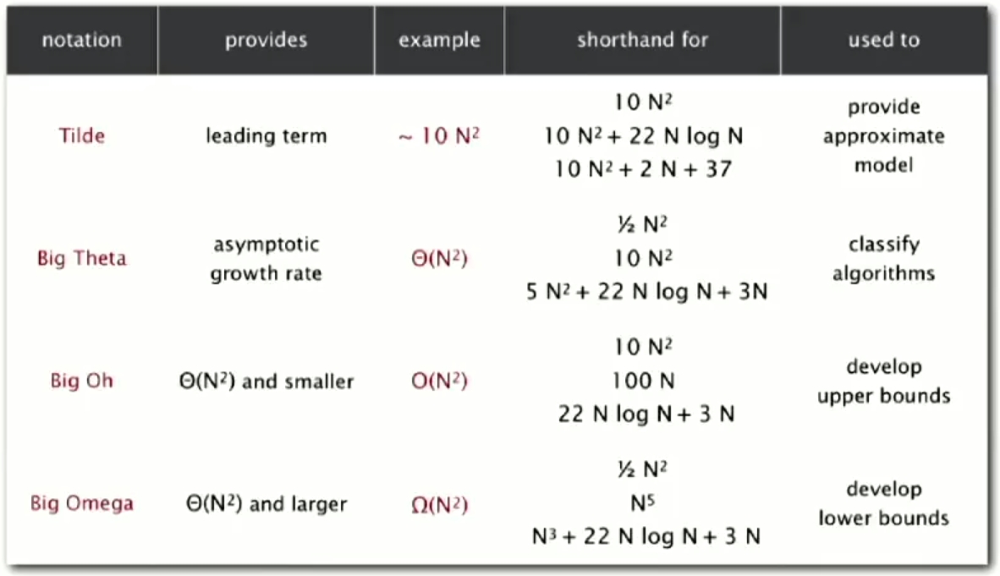

Analysis Of Algorithms
===========
Mathmatically Analysis
## 1. Observation ~ Mathmatical Model
- To compute computational time, We can estimate cycle.
- Big order compuation 'Dominate' whole computation time.
- So, we only consider the highest 'Order' of computation.

* example

## 2. Order Of Growth Classification
- Tag : Order, Time, Order of growth

    

## 3. Theory of Algorithm

- Big Oh &nbsp;&nbsp;&nbsp;&nbsp;&nbsp;&nbsp;&nbsp;: Upper bound
- Big Theta&nbsp;&nbsp;&nbsp;&nbsp;: Always
- Big Omega : Lower bound

    

## 4. Memory

- Primitive type : 
    * boolean : 1 bytes
    * char : 2 bytes
    * int : 4 bytes
    * float : 4 bytes
    * long : 8 bytes
    * double : 8 bytes
    
- Object reference : 8 bytes
- Array : 24 bytes + memory for each array entry.
- Object : 16 bytes + memory for each variable + 8 bytes(inner class)
- Padding : multiple 8 bytes